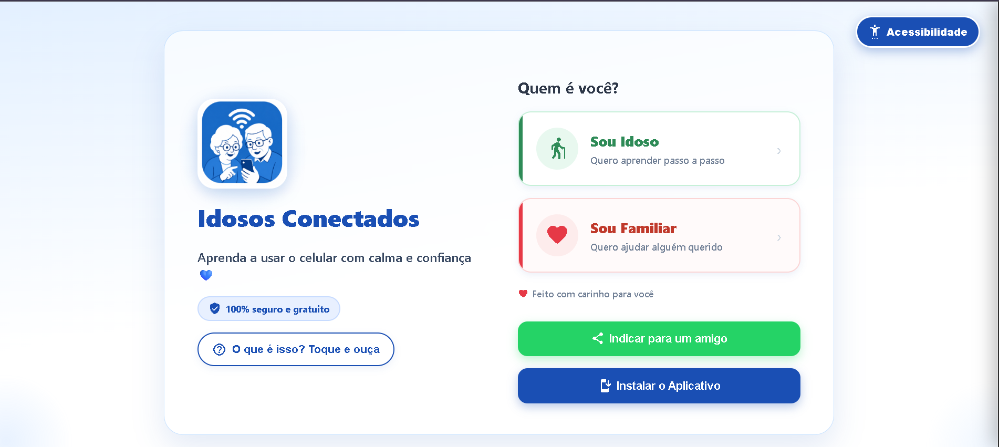
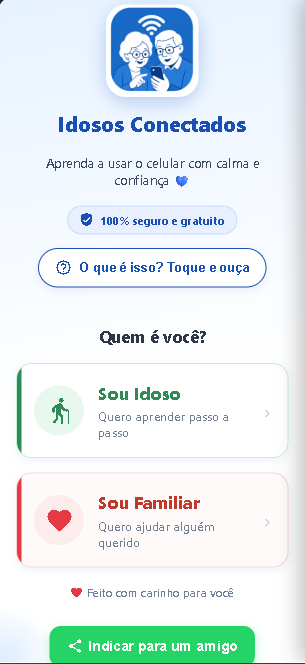
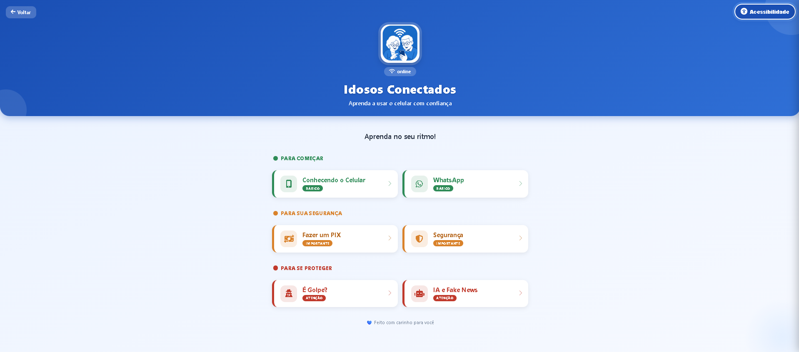
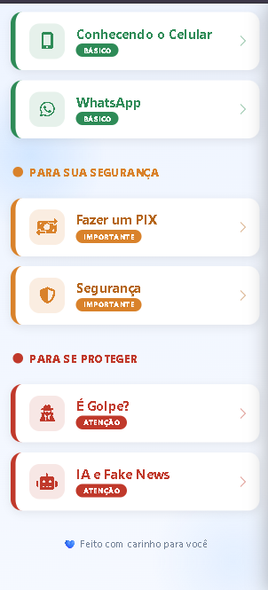
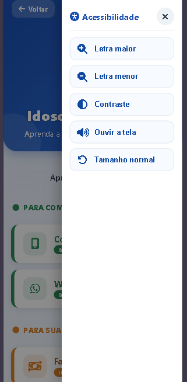

# 👵📱 Idosos Conectados


---

## 🌐 Demonstração

👉 https://idosos-conectados.netlify.app/

---

## 📌 Sobre o Projeto

O **Idosos Conectados** é uma aplicação web criada para ajudar idosos a usarem tecnologia de forma mais simples e segura.

A ideia nasceu da dificuldade real que muitas pessoas idosas têm com ferramentas como WhatsApp, PIX e navegação básica na internet.

O foco do projeto é ser simples, direto e fácil de entender, sem excesso de informação ou complicação.

---

## 🎯 Problema

Muitos idosos enfrentam dificuldades no uso da tecnologia no dia a dia, como:

- Dificuldade para usar aplicativos básicos  
- Falta de orientação clara  
- Exposição a golpes digitais  
- Dependência de outras pessoas para tarefas simples  

---

## 💡 Solução

Criar uma plataforma educativa que ensina o uso da tecnologia de forma prática, com linguagem simples e módulos separados por tema.

---

## ⚙️ Funcionalidades

- Interface simples e fácil de usar  
- Modo de acessibilidade (fonte maior e contraste)  
- Conteúdo dividido em módulos  
- Design responsivo (celular e computador)  
- Aplicação instalável (PWA)  
- Navegação leve e rápida  

---

## 📚 Módulos

- 📱 Uso do celular  
- 💬 WhatsApp  
- 💳 PIX  
- 🤖 Inteligência Artificial (introdução)  
- 🔒 Segurança digital  
- ⚠️ Golpes e fraudes  
- 👨‍👩‍👧 Apoio para familiares  

---

## 🧠 Tecnologias

- HTML5  
- CSS3  
- JavaScript (Vanilla)  
- PWA (Service Worker + Manifest)

---

## ♿ Acessibilidade

O projeto foi pensado para facilitar o uso por pessoas com pouca familiaridade digital:

- Fonte ajustável  
- Alto contraste  
- Layout simples  
- Menos distrações visuais  
- Navegação direta  

---

## 📸 Telas do Sistema

### 🏠 Tela inicial (PC)


### 📱 Tela inicial (Mobile)


### 📚 Módulos (PC)


### 📱 Módulos (Mobile)


### ♿ Acessibilidade


---

## 📁 Estrutura do projeto

```bash
conecta-idosos/
├── assets/
│   └── screenshots/
├── icons/
├── js/
├── paginas/
├── index.html
├── modulos.html
├── manifest.json
├── sw.js/
└── README.md
```

---

## 🚀 Status

Projeto em versão beta, funcionando e em evolução.

---

## 👥 Público

- Idosos em processo de inclusão digital  
- Familiares que ajudam idosos  
- Projetos educacionais  
- Iniciativas sociais de tecnologia  

---

## 🤝 Contribuições

Sugestões e melhorias são bem-vindas.

Abra uma issue ou envie um pull request.

---

## 👨‍💻 Autor

**Guilherme Noé de Albuquerque**

Projeto acadêmico de ADS (Análise e Desenvolvimento de Sistemas).

---

## 📄 Licença

Uso educacional e acadêmico.

